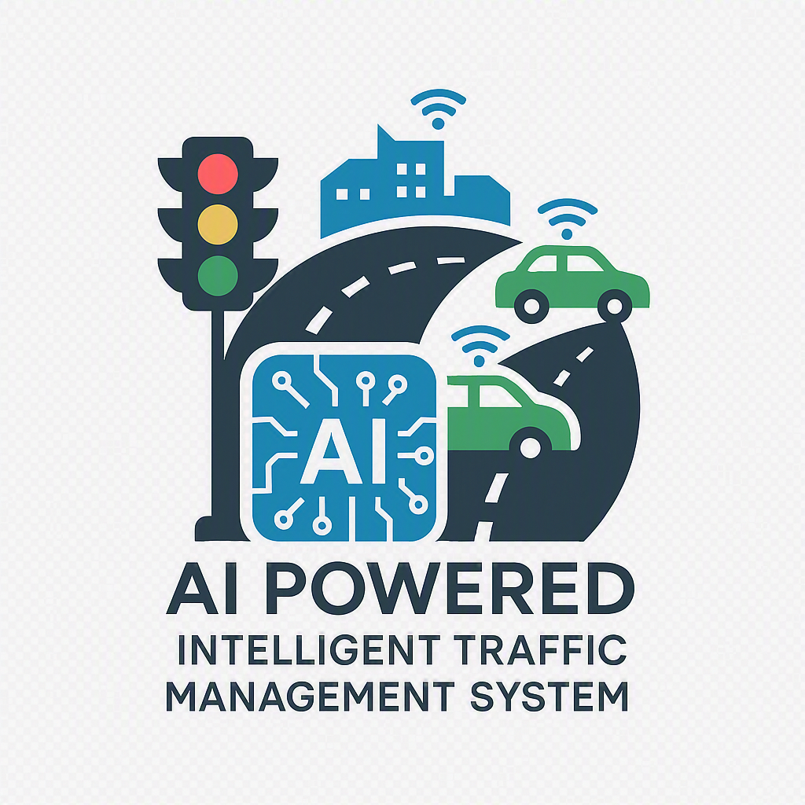

<div align="center">

# 🚦 Smart City AI
## AI-Powered Intelligent Traffic Management System

### Traffic Intelligence Platform • Version 6.0 • Production

<p align="center">

</p>


<br/>

### 🟢 [**Launch the Live App →**](https://ai-powered-intelligent-traffic-management-system-bkpdj5xodzeer.streamlit.app/)

**[https://ai-powered-intelligent-traffic-management-system-bkpdj5xodzeer.streamlit.app/](https://ai-powered-intelligent-traffic-management-system-bkpdj5xodzeer.streamlit.app/)**

*No install needed — upload a traffic photo or video and run the full AI pipeline right in your browser.*

### 🚀 Building the Future of Intelligent Transportation for Smart Cities

</div>

---

<div align="center">

### ⚡ Quick Links

[**🟢 Live Demo**](https://ai-powered-intelligent-traffic-management-system-bkpdj5xodzeer.streamlit.app/) &nbsp;•&nbsp;
[Overview](#-overview) &nbsp;•&nbsp;
[Features](#-key-features) &nbsp;•&nbsp;
[Workflow](#-ai-workflow) &nbsp;•&nbsp;
[Installation](#-installation) &nbsp;•&nbsp;
[Deployment](#-deployment) &nbsp;•&nbsp;
[Roadmap](#-future-roadmap) &nbsp;•&nbsp;
[Developer](#-developer)

</div>

---

# 📖 Overview

**Smart City AI** is an AI-powered Intelligent Traffic Management System that turns a single uploaded traffic photo or video into a complete, end-to-end traffic intelligence report — vehicle detection, live analytics, a short-term traffic forecast, a live monitoring view, and a downloadable report — all inside one seamless, auto-navigating dashboard.

The platform integrates:

- 🚗 Vehicle Detection
- 📊 Traffic Analytics
- 🤖 Traffic Prediction
- 📡 Live Monitoring
- 🚦 Intelligent Signal Recommendation
- 📄 Automated AI Reports (CSV + JSON)

Unlike a set of disconnected demo pages, every module in this platform reads from **one shared session state**, so a single upload flows automatically through the entire pipeline — Detection → Analytics → Prediction → Monitoring → Report — with real numbers carried forward at every stage, and lands you back on the dashboard with a full summary.

<div align="center">

### 🖼️ Live Preview

| Prediction Results |
|:---:|
| Confidence-scored traffic forecast, congestion gauge, and signal-time recommendation, generated live from your uploaded footage |

*(Add your own screenshots to `assets/screenshots/` and reference them here — `Home.png`, `Detection.png`, `Analytics.png`, `Prediction.png`, `Monitoring.png`, `Report.png`)*

</div>

---

# 🚨 Problem Statement

India experiences one of the world's highest numbers of road accidents.

According to various government reports:

- 75–85% of accidents are related to traffic management issues.
- Fixed traffic signals cannot adapt to real-time congestion.
- Emergency vehicles lose valuable response time.
- Traffic monitoring remains largely manual.
- Existing systems are reactive rather than predictive.

This project builds an AI-powered platform capable of making smarter, forward-looking traffic decisions using Computer Vision and Machine Learning.

---

# 🎯 Project Objectives

- Reduce road congestion
- Improve traffic monitoring
- Assist traffic authorities
- Predict near-term future congestion
- Recommend signal timing optimization
- Generate downloadable AI reports
- Support future Smart City infrastructure

---

# ✨ Key Features

## 🚗 Vehicle Detection
- Real-time vehicle detection on images and video
- Multi-class vehicle classification (Car, Bus, Truck, Motorcycle, Bicycle)
- Automatic vehicle counting
- Annotated detection output, downloadable as JPEG
- Graceful **built-in demo detection engine** — the app produces real, non-zero results even without a trained YOLO backend wired in, so it's never stuck showing placeholder zeros

## 📊 Analytics Dashboard
- Vehicle distribution (bar + pie charts)
- Live traffic density & congestion scoring
- Road-zone density heatmap
- Real-time trend chart across the current session
- Downloadable analytics summary (CSV)

## 🤖 AI Prediction
Forecasts **near-term future traffic**, not the current count — configurable by:
- Hour of day
- Weather condition (Clear / Clouds / Rain / Fog / Snow)
- Holiday flag

Outputs:
- Predicted future vehicle volume
- Predicted congestion level & density
- Recommended green-signal duration
- Prediction confidence score

## 📡 Live Monitoring
- Live KPI dashboard (vehicles, density, congestion, waiting time)
- Real-time vehicle-count trend chart
- System/module health status
- AI-generated traffic insights and recommendations

## 📄 AI Report
Automatically compiles:
- Vehicle count & density
- Analytics summary
- Prediction summary
- Signal recommendation
- Timestamp

Downloadable as **CSV** and **JSON**, with an executive-summary view built in.

---

# 🧠 AI Workflow

```
Upload Image / Video
          │
          ▼
   Start AI Pipeline
          │
          ▼
  Vehicle Detection
          │
          ▼
  Traffic Analytics
          │
          ▼
  Traffic Prediction
          │
          ▼
  Live Monitoring
          │
          ▼
  AI Report Generation
          │
          ▼
 Back to Dashboard (full summary)
```

The upload happens **only once**. Clicking **▶ Start AI Pipeline** auto-advances through every stage above — actually running each stage's logic, not just animating a progress bar — and every page reads from the same shared result, so nothing resets to zero as you move between them. You can also jump to any single stage directly from the clickable workflow diagram on the Home page.

---

# 🏗 System Architecture

```
             User Upload
                  │
                  ▼
          Home Dashboard
                  │
                  ▼
         Shared Session State
        (single source of truth)
                  │
────────────────────────────────────────────
│              │              │            │
▼              ▼              ▼            ▼

Detection   Analytics   Prediction   Monitoring

────────────────────────────────────────────
                  │
                  ▼

           Final AI Report
```

**Design note:** every page (Detection / Analytics / Prediction / Monitoring / Report) reads from one shared `live_data` snapshot instead of independently re-querying the AI backend on every rerun. If a real AI backend (`traffic_ai.system.AISystemManager`) is available, it's used automatically and checked under both `manager` and `system_manager` session-state keys for compatibility with older versions of this project; if it isn't available or returns nothing usable, a self-contained OpenCV-based demo engine produces real, repeatable, non-zero results instead.

---

# 🖥 Dashboard Modules

| Module | Description |
|---------|-------------|
| 🏠 Home | Upload images/videos, view the clickable workflow, and run the full AI pipeline |
| 🚗 Vehicle Detection | Detect and count vehicles in the uploaded footage |
| 📊 Traffic Analytics | Distribution charts, density heatmap, congestion gauge, trend chart |
| 🤖 Traffic Prediction | Forecast near-term traffic volume and recommend signal timing |
| 📡 Live Monitoring | Live KPI dashboard and system health status |
| 📄 AI Report | Full report preview with CSV/JSON download |
| ℹ️ About | Project, tech stack, and developer information |

---

# 🛠 Technology Stack

## AI & Computer Vision
- OpenCV (+ optional YOLOv8 backend)
- Scikit-Learn / Random Forest (prediction)
- NumPy, Pandas

## Visualization
- Plotly (interactive gauges, charts, heatmaps)

## Frontend
- Streamlit

## Backend
- Python 3.11

## Deployment
- Streamlit Community Cloud *(current live deployment)*
- Hugging Face Spaces *(alternative — recommended for faster, more reliable builds)*
- GitHub

---

# 📂 Project Structure

```
AI-Powered-Intelligent-Traffic-Management-System/
│
├── my.py                  # Production single-file app (recommended entry point)
├── app.py                 # Modular multi-file variant (optional)
│
├── dashboard/              # Modular page implementations (optional variant)
│     ├── home.py
│     ├── detection.py
│     ├── analytics.py
│     ├── prediction.py
│     ├── monitoring.py
│     ├── about.py
│     └── _shared.py        # Dual-key session-state helpers
│
├── traffic_ai/              # Optional real AI backend
│     └── system.py          # AISystemManager (auto-detected if present)
│
├── assets/
│     ├── logo.png
│     ├── style.css
│     └── screenshots/
│
├── outputs/                 # Runtime-generated detection results
├── models/                  # Optional trained model files
├── requirements.txt
├── runtime.txt              # Pins Python 3.11 for reliable cloud builds
└── README.md
```

---

# 🚀 Installation

Clone the repository

```bash
git clone https://github.com/ASHISH8652/AI-Powered-Intelligent-Traffic-Management-System.git
```

Move into the project

```bash
cd AI-Powered-Intelligent-Traffic-Management-System
```

Install dependencies

```bash
pip install -r requirements.txt
```

Run locally

```bash
streamlit run my.py
```

The app opens at `http://localhost:8501` — upload a traffic image or video and click **Start AI Pipeline**.

---

# ☁ Deployment

### 🟢 Currently deployed on Streamlit Community Cloud
**[https://ai-powered-intelligent-traffic-management-system-bkpdj5xodzeer.streamlit.app/](https://ai-powered-intelligent-traffic-management-system-bkpdj5xodzeer.streamlit.app/)**

Deployment relies on two files that keep the build reliable:
- `requirements.txt` — version-range pins so pip can resolve wheels that actually exist for the runtime
- `runtime.txt` — pins the container to **Python 3.11**, avoiding build failures against newer Python versions with incomplete wheel coverage

### Alternative: Hugging Face Spaces
For faster, more predictable builds with no GitHub OAuth friction:
1. Create a new Space → SDK: **Streamlit**
2. Upload `my.py` (as `app.py`), `requirements.txt`, and `assets/`
3. Space builds and deploys automatically — typically live in 2–4 minutes

---

# 📈 Current Features

- ✅ Vehicle Detection (real backend or built-in demo engine)
- ✅ Traffic Analytics with live density heatmap
- ✅ Machine Learning / heuristic Traffic Prediction
- ✅ Live Monitoring Dashboard
- ✅ Auto-navigating AI pipeline (Detection → Report, end to end)
- ✅ Clickable workflow diagram for manual navigation
- ✅ Downloadable reports (CSV + JSON + JPEG)
- ✅ Shared session-state architecture (no more "please run detection" loops)
- ✅ Cloud-deployment-ready (Streamlit Cloud & Hugging Face Spaces)

---

# 🚀 Future Roadmap

### Phase 1
- Adaptive Signal Control
- Real-time CCTV Integration
- Persistent multi-session history

### Phase 2
- Emergency Corridor AI
- License Plate Recognition
- Violation Detection
- AI Challan Generation

### Phase 3
- Google Maps Integration
- Smart Parking
- Weather-based Signal Control
- Traffic Heatmaps at city scale

### Phase 4
- Reinforcement Learning Signal Optimization
- Digital Twin Simulation
- Carbon Emission Estimation
- Explainable AI Dashboard

---

# 🌍 Future Smart City Features

- Emergency Vehicle Priority
- AI Traffic Police Assistant
- Accident Detection
- School Zone Safety
- Illegal Parking Detection
- Smart Parking
- Public Transport Priority
- AI Traffic Education Platform
- Vehicle Information Lookup (Official APIs)
- Insurance Integration
- Digital Twin City

---

# 📊 Machine Learning Performance

Model:
- Random Forest Regressor (prediction)

Evaluation Metrics:
- MAE
- MSE / RMSE
- R² Score
- Explained Variance Score

*(Populate this section with your latest training run's results.)*

---

# 👨‍💻 Developer

**Ashish Kumar Prusty**

B.Tech (Artificial Intelligence & Machine Learning)
GITA Autonomous College, Bhubaneswar, Odisha, India

GitHub: [https://github.com/ASHISH8652](https://github.com/ASHISH8652)
LinkedIn: [https://linkedin.com/in/ashish-kumar-prusty-7947ba263](https://linkedin.com/in/ashish-kumar-prusty-7947ba263)

---

# 🤝 Contributions

Contributions are welcome.

Feel free to fork this repository and submit pull requests.

---

# ⭐ Support

If you like this project:

⭐ Star this repository
🍴 Fork it
📢 Share it

---

# 📜 License

This project is licensed under the MIT License.

---

<div align="center">

## 🚦 Smart City AI

### Making Roads Safer with Artificial Intelligence

**"Predict • Prevent • Protect"**

### 🟢 [**Try it live →**](https://ai-powered-intelligent-traffic-management-system-bkpdj5xodzeer.streamlit.app/)

Built with ❤️ by Ashish Kumar Prusty

</div>
